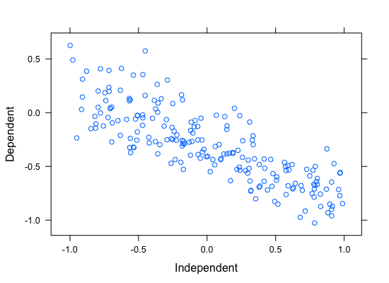
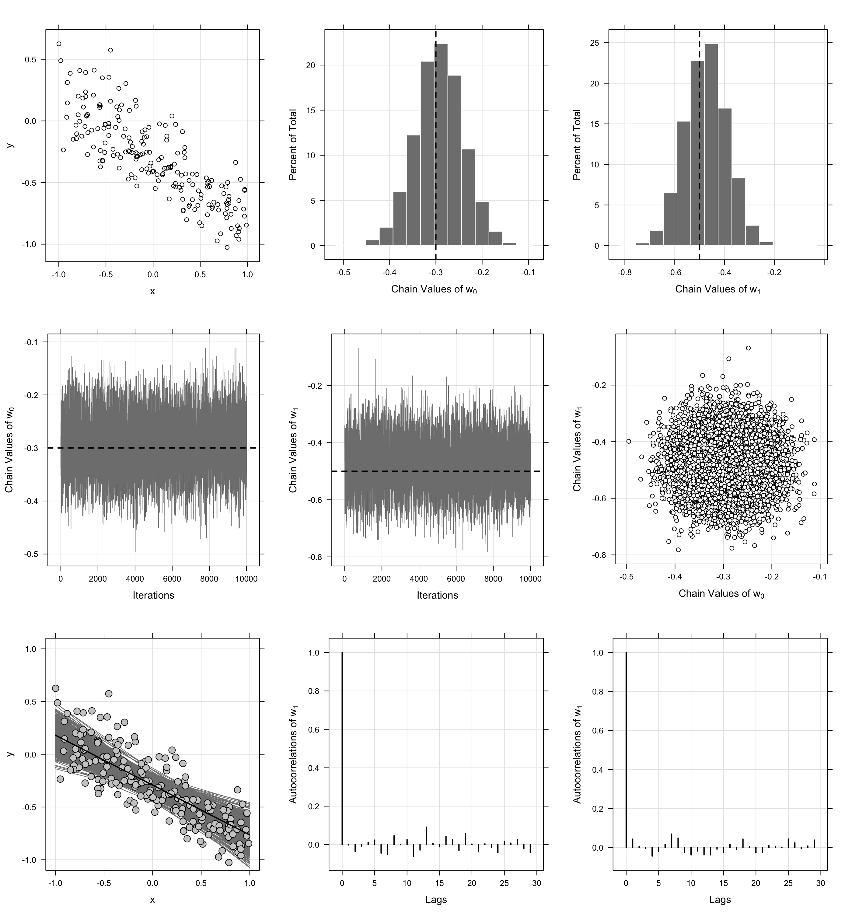

*********
StochMCMC.r
*********
*A R package for Stochastic Gradient Markov Chain Monte Carlo*

This package is part of my master's thesis entitled **Bayesian Autoregressive Distributed Lag** *via* **Stochastic Gradient Hamiltonian Monte Carlo** or BADL-SGHMC. However as the title says, this package aims to accomodate other Stochastic Gradient MCMCs in the near future. At the latest, the following are the MCMC algorithms available:

1. Metropolis-Hasting
2. Hamiltonian Monte Carlo
3. Stochastic Gradient Hamiltonian Monte Carlo

Installation
==================
To install the package, simply run the following codes

.. code-block:: R

	library(devtools)
	install_github("alstat/StochMCMC.r")

And to load the package:

.. code-block:: R
	
	library(StochMCMC)

Tutorial
==================
Bayesian Linear Regression
---------------------
In order to illustrate the modeling, the data is simulated from a simple linear regression expectation function. That is the model is given by

.. code-block:: R

	y_i = w_0 + w_1 x_i + e_i,   e_i ~ N(0, 1 / a)

Data Simulation
~~~~~~~~~~~~~~~~~~~~~~~
To do so, let `B = [w_0, w_1]' = [.2, -.9]', a = 1 / 5`. Generate 200 hypothetical data:

.. code-block:: R

	library(gridExtra)
	library(lattice)
	library(StochMCMC)

	set.seed(123)

	# Define data parameters
	w0 <- -.3; w1 <- -.5; stdev <- 5.; a <- 1 / stdev

	# Generate Hypothetical Data
	n <- 200;
	x <- runif(n, -1, 1);
	A <- cbind(1, x);
	B <- rbind(w0, w1);
	f <- A %*% B;
	y <- f + rnorm(n, 0, a);

	my_df = data.frame(Independent = round(x, 4), Dependent = round(y, 4));

To view the head of the data, run the following:

.. code-block:: julia

	head(my_df)
	#   Independent Dependent
	# 1     -0.4248   -0.2297
	# 2      0.5766   -0.5369
	# 3     -0.1820   -0.2583
	# 4      0.7660   -0.7525
	# 5      0.8809   -0.9308
	# 6     -0.9089    0.1454

Next is to plot this data which can be done as follows:

.. code-block:: julia

	xyplot(Dependent ~ Independent, data = my_df, type = c("p", "g"), col = "black")



Setup Probabilities
~~~~~~~~~~~~~~~~~~
In order to proceed with the Bayesian inference, the parameters of the model is considered to be random modeled by a standard Gaussian distribution. That is, `B ~ N(0, I)`, where `0` is the zero vector. The likelihood of the data is given by,

.. code-block:: txt

	L(w|[x, y], b) = ∏_{i=1}^n N([x_i, y_i]|w, b)

Thus the posterior is given by,

.. code-block:: txt

	P(w|[x, y]) ∝ P(w)L(w|[x, y], b)

To start programming, define the probabilities

.. code-block:: R

	# The log prior function is given by the following codes:
	logprior <- function(theta, mu = zero_vec, s = eye_mat) {
	    w0_prior <- dnorm(theta[1], mu[1], s[1, 1], log = TRUE)
	    w1_prior <- dnorm(theta[2], mu[2], s[2, 2], log = TRUE)
	    w_prior <- c(w0_prior, w1_prior)

	    w_prior %>% sum %>% return
	}

	# The log likelihood function is given by the following codes:
	loglike <- function(theta, alpha = a) {
	    yhat <- theta[1] + theta[2] * x

	    likhood <- numeric()
	    for (i in 1:length(yhat)) {
	        likhood[i] <- dnorm(y[i], yhat[i], alpha, log = TRUE)
	    }

	    likhood %>% sum %>% return
	}

	# The log posterior function is given by the following codes:
	logpost <- function(theta) {
	    loglike(theta, alpha = a) + logprior(theta, mu = zero_vec, s = eye_mat)
	}

Metropolis-Hasting
~~~~~~~~~~~~~~~~~~~
To start the estimation, define the necessary parameters for the Metropolis-Hasting algorithm

.. code-block:: R

	# Hyperparameters
	zero_vec <- c(0, 0)
	eye_mat <- diag(2)

Run the MCMC:

.. code-block:: R

	set.seed(123);
	mh_object <- MH(logpost, init_est = c(0, 0))
	chain1 <- mcmc(mh_object, r = 10000)

Extract the estimate

.. code-block:: R

	burn_in <- 100;
	thinning <- 10;

	# Expetation of the Posterior
	est1 <- colMeans(chain1[seq((burn_in + 1), nrow(chain1), by = thinning), ])
	est1
	# [1] -0.2984246 -0.4964463

Hamiltonian Monte Carlo
~~~~~~~~~~~~~~~~~~~~~~
Setup the necessary paramters including the gradients. The potential energy is the negative logposterior given by `U`, the gradient is `dU`; the kinetic energy is the standard Gaussian function given by `K`, with gradient `dK`. Thus,

.. code-block:: R

	U <- function(theta) - logpost(theta)
	K <- function(p, Sigma = diag(length(p))) (t(p) %*% solve(Sigma) %*% p) / 2
	dU <- function(theta, alpha = a, b = eye_mat[1, 1]) {
	    c(
	        - alpha * sum(y - (theta[1] + theta[2] * x)),
	        - alpha * sum((y - (theta[1] + theta[2] * x)) * x)
	    ) + b * theta
	}

	dK <- function (p, Sigma = diag(length(p))) solve(Sigma) %*% p

Run the MCMC:

.. code-block:: R

	set.seed(123)
	HMC_object <- HMC(U, K, dU, dK, c(0, 0), 2)
	chain2 <- mcmc(HMC_object, leapfrog_params = c(eps = .09, tau = 20), r = 10000)

Extract the estimate

.. code-block:: R

	est2 <- colMeans(chain2[seq((burn_in + 1), nrow(chain2), by = thinning), ])
	est2
	# [1] -0.2977521 -0.5158439

Stochastic Gradient Hamiltonian Monte Carlo
~~~~~~~~~~~~~~~~~~~~~
Define the gradient noise and other parameters of the SGHMC:

.. code-block:: R

	dU_noise <- function(theta, alpha = a, b = eye_mat[1, 1]) {
	    c(
	        - alpha * sum(y - (theta[1] + theta[2] * x)),
	        - alpha * sum((y - (theta[1] + theta[2] * x)) * x)
	    ) + b * theta + matrix(rnorm(2), 2, 1)
	}

Run the MCMC:

.. code-block:: R

	set.seed(123)
	SGHMC_object <- SGHMC(dU_noise, dK, diag(2), diag(2), diag(2), init_est = c(0, 0), 2)
	chain3 <- mcmc(SGHMC_object, leapfrog_params = c(eps = .09, tau = 20), r = 10000)

Extract the estimate:

.. code-block:: R

	est3 <- colMeans(chain3[seq((burn_in + 1), nrow(chain3), by = thinning), ])
	est3
	# [1] -0.2920243 -0.4729136

Plot it

.. code-block:: R
	p0 <- xyplot(y ~ x, type = c("p", "g"), col = "black") %>%
	    update(xlab = "x", ylab = "y")

	p1 <- histogram(chain3[, 1], col = "gray50", border = "white") %>%
	    update(xlab = expression(paste("Chain Values of ", w[0]))) %>%
	    update(panel = function (x, ...) {
	        panel.grid(-1, -1)
	        panel.histogram(x, ...)
	        panel.abline(v = w0, lty = 2, col = "black", lwd = 2)
	  })

	p2 <- histogram(chain3[, 2], col = "gray50", border = "white") %>%
	    update(xlab = expression(paste("Chain Values of ", w[1]))) %>%
	    update(panel = function (x, ...) {
	        panel.grid(-1, -1)
	        panel.histogram(x, ...)
	        panel.abline(v = w1, lty = 2, col = "black", lwd = 2)
	  })

	p3 <- xyplot(chain3[, 1] ~ 1:nrow(chain3[, ]), type = c("g", "l"), col = "gray50", lwd = 1) %>%
	    update(xlab = "Iterations", ylab = expression(paste("Chain Values of ", w[0]))) %>%
	    update(panel = function (x, y, ...) {
	        panel.xyplot(x, y, ...)
	        panel.abline(h = w0, col = "black", lty = 2, lwd = 2)
	  })

	p4 <- xyplot(chain3[, 2] ~ 1:nrow(chain3[,]), type = c("g", "l"), col = "gray50", lwd = 1) %>%
	    update(xlab = "Iterations", ylab = expression(paste("Chain Values of ", w[1]))) %>%
	    update(panel = function (x, y, ...) {
	        panel.xyplot(x, y, ...)
	        panel.abline(h = w1, col = "black", lty = 2, lwd = 2)
	  })

	p5 <- xyplot(chain3[, 2] ~ chain3[, 1]) %>%
	    update(type = c("p", "g"), pch = 21, fill = 'white', col = "black") %>%
	    update(xlab = expression(paste("Chain Values of ", w[0]))) %>%
	    update(ylab = expression(paste("Chain Values of ", w[1]))) %>%
	    update(panel = function (x, y, ...) {
	        panel.xyplot(x, y, ...)
	    })

	p6 <- xyplot(y ~ x, col = "black", fill = "gray80", cex = 1.3, type = "p", pch = 21) %>% 
	    update(xlim = c(-1.1, 1.1), ylim = c(-1.1, 1.1), panel = function(x, y, ...) {
	        panel.grid(h = -1, v = -1)
	        xseq <- seq(-1, 1, length.out = 100)
	        for (i in seq((burn_in + 1), nrow(chain3), by = thinning)) {
	            yhat <- chain3[i, 1] + chain3[i, 2] * xseq
	            panel.xyplot(xseq, yhat, type = "l", col = "gray50")  
	        }
	        panel.xyplot(x, y, ...)
	        panel.xyplot(xseq, est3[1] + est3[2] * xseq, type = "l", col = "black", lwd = 2)
	  })

	acf1 <- acf(chain3[seq((burn_in + 1), nrow(chain3), by = thinning), 1], plot = FALSE)
	acf2 <- acf(chain3[seq((burn_in + 1), nrow(chain3), by = thinning), 2], plot = FALSE)
	p7 <- xyplot(acf1$acf ~ acf1$lag, type = c("h", "g"), lwd = 2, col = "black") %>%
	    update(xlab = "Lags", ylab = expression(paste("Autocorrelations of ", w[1])))

	p8 <- xyplot(acf2$acf ~ acf2$lag, type = c("h", "g"), lwd = 2, col = "black") %>%
	    update(xlab = "Lags", ylab = expression(paste("Autocorrelations of ", w[1])))

	grid.arrange(p0, p1, p2, p3, p4, p5, p6, p7, p8, ncol = 3)
```


